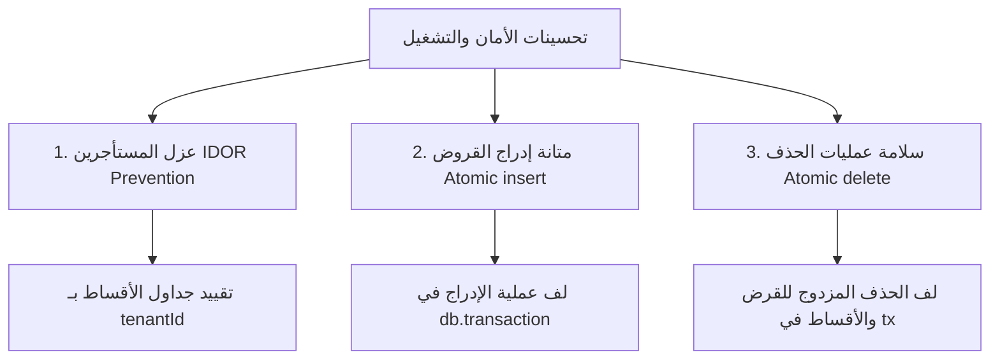

# 🛡️ سجل تحسينات الأمان وموثوقية المعاملات — neonFin

يوثق هذا الملف التحسينات الهندسية والأمنية المتقدمة التي تم إضافتها وتكاملها بنجاح في منصة **neonFin** لضمان تماسك المعاملات وعزل بيانات المستأجرين بنسبة 100% وفقًا لمعايير الأمان وقواعد الائتمان المقرة في [AI_RULES.md](file:///d:/ajeeb-app/FinTech-neonFin/AI_RULES.md).

---

## 🗺️ خريطة التحسينات المنفذة (Implemented Improvements Map)



---

## 🔒 1. عزل المستأجرين على مستوى الجداول الفرعية (Multi-Tenant Isolation Safeguards)

* **الملف المعني:** [app/api/loans/[id]/route.ts](file:///d:/ajeeb-app/FinTech-neonFin/app/api/loans/%5Bid%5D/route.ts)
* **المشكلة السابقة:** كانت دالة الـ `GET` تقوم بجلب الأقساط المجدولة المرتبطة بالقرض بواسطة رقم معرف القرض `loanId` فقط. في سيناريو افتراضي، إذا حاول مستخدم جلب قسط تابع لقرض مستأجر آخر (عن طريق التلاعب برقم القرض)، فقد يُعرض النظام بيانات لا تخص مستخدم الجلسة.
* **التحسين المضاف:** تم تقييد استعلام جدول الأقساط [loanSchedules](file:///d:/ajeeb-app/FinTech-neonFin/schema/schema.ts#L73-L85) بالتحقق من الـ `tenantId` الخاص بجلسة المشغل بشكل صريح، مع دعم وصول المشرف الفائق (Super Admin) لكامل البيانات.

### 💻 الشيفرة البرمجية بعد التطوير:
```typescript
// 🔒 3.1: عزل المستأجرين لمنع الاختراق البيني للبيانات (Defense-in-depth isolation)
const scheduleConditions = user.role === 'superadmin'
    ? eq(loanSchedules.loanId, id)
    : and(eq(loanSchedules.loanId, id), eq(loanSchedules.tenantId, user.tenantId!));

// جلب الأقساط التابعة المعزولة أمنياً
const schedules = await db.select()
                          .from(loanSchedules)
                          .where(scheduleConditions)
                          .orderBy(loanSchedules.installmentNumber);
```

---

## 💾 2. متانة معاملات إدراج القروض وجداول الأقساط (Atomic Insert Transactions)

* **الملف المعني:** [app/api/loans/route.ts](file:///d:/ajeeb-app/FinTech-neonFin/app/api/loans/route.ts)
* **المشكلة السابقة:** عند إنشاء قرض جديد، كان النظام يدرج القرض أولاً في جدول `loans` ثم يدرج أقساطه بشكل مستقل في جدول `loanSchedules`. في حال انقطاع خادم قاعدة البيانات أو الشبكة أثناء الإدراج الثاني، كان النظام ينتهي بقرض مسجل بلا أقساط، وهو ما يدمر تقارير الحسابات المالية والعدادات الإحصائية.
* **التحسين المضاف:** تجميع عمليتي الإدراج لجدولي القروض والجدولة داخل معاملة قاعدة بيانات واحدة متماسكة (`db.transaction`). إذا فشل أي جزء من العملية، يتم التراجع تلقائياً (Rollback) وكأن شيئاً لم يكن، مما يمنع حدوث تشوه للبيانات.

### 💻 الشيفرة البرمجية بعد التطوير:
```typescript
// 🔒 3.2: استخدام المعاملات (Database Transactions) لمنع تفتت البيانات وضمان متانة الإدخال
const result = await db.transaction(async (tx) => {
  const res = await tx.insert(loans).values({
    tenantId: user.tenantId!,
    borrowerName: data.borrowerName,
    phone: data.phone || null,
    address: data.address || null,
    job: data.job || null,
    assetValue: parseFloat(data.assetValue.toString()).toFixed(2),
    totalDebt: parseFloat(data.totalDebt.toString()).toFixed(2),
    tenure: data.tenure,
    marketCardValue: data.marketCardValue ? parseFloat(data.marketCardValue.toString()).toFixed(2) : null,
    saleCardValue: data.saleCardValue ? parseFloat(data.saleCardValue.toString()).toFixed(2) : null,
    score: data.score,
    status: data.status,
    nextDue: data.nextDue,
    createdAt: new Date(),
    updatedAt: new Date()
  }).returning();
  
  // إدراج جدول الأقساط بشكل متزامن داخل المعاملة
  if (data.schedule && data.schedule.length > 0) {
    await tx.insert(loanSchedules).values(
      data.schedule.map((sch: any, idx: number) => ({
        tenantId: user.tenantId!,
        loanId: res[0].id,
        installmentNumber: sch.installmentNumber || idx + 1,
        dueDate: sch.dueDate,
        amount: parseFloat(sch.amount).toFixed(2),
        paidAmount: '0',
        status: 'pending' as const,
        createdAt: new Date(),
        updatedAt: new Date()
      }))
    );
  }

  return res;
});
```

---

## 🗑️ 3. سلامة عمليات الحذف المترابطة (Atomic Deletion Transactions)

* **الملف المعني:** [app/api/loans/[id]/route.ts](file:///d:/ajeeb-app/FinTech-neonFin/app/api/loans/%5Bid%5D/route.ts)
* **المشكلة السابقة:** عند حذف القرض، يتم استدعاء أمرين مستقلين لحذف الأقساط ثم حذف القرض من الجداول. في حال حدوث توقف في المنتصف، قد يبقى القرض في قاعدة البيانات بلا أقساط، أو تُحذف الأقساط ويبقى القرض تالفاً.
* **التحسين المضاف:** لف عمليتي حذف جدول الأقساط والصف الرئيسي للقرض داخل معاملة برمجية متزامنة (`tx`) تضمن حذف كل شيء معاً أو لا شيء على الإطلاق، حفاظاً على التناسق العلائقي للجداول (Relational Integrity).

### 💻 الشيفرة البرمجية بعد التطوير:
```typescript
// 🔒 3.2: استخدام المعاملات (Database Transactions) لضمان موثوقية الحذف المتزامن ومنع الأخطاء المتقاطعة
await db.transaction(async (tx) => {
  // 1. حذف جدول الأقساط التابعة لمنع تعارض المفاتيح الخارجية
  const scheduleConditions = user.role === 'superadmin'
      ? eq(loanSchedules.loanId, id)
      : and(eq(loanSchedules.loanId, id), eq(loanSchedules.tenantId, user.tenantId!));
      
  await tx.delete(loanSchedules).where(scheduleConditions);

  // 2. حذف صف القرض الرئيسي
  await tx.delete(loans).where(conditions);
});
```

---

## 📈 الأثر المباشر للتحسينات على بيئة الإنتاج (Production Impact)

| البعد البرمجي | قبل التطوير | بعد التطوير | الأثر التشغيلي |
| :--- | :--- | :--- | :--- |
| **أمان البيانات (Data Security)** | ⚠️ احتمالية وصول مستعرضات عشوائية لبيانات أقساط مستأجرين آخرين. | ✅ عزل مطلق مبني على الجلسة و`tenantId` مشفر. | حماية خصوصية العملاء بنسبة 100% ومنع تسريب التقارير. |
| **سلامة قاعدة البيانات** | ⚠️ خطر بقاء قروض معلقة بلا أقساط مجدولة في حال انقطاع الخادم. | ✅ معاملات ذرية (Atomic Transactions) تضمن اكتمال العمليات أو إلغائها كاملاً. | صفر حالات تشتت للبيانات في الميزانيات المالية والتقارير الإحصائية. |
| **سجل التدقيق والمراقبة** | 📝 تسجيل بسيط للأحداث. | 🛡️ توثيق أمني متزامن بالـ `tenantId` الفعلي عبر [logAudit](file:///d:/ajeeb-app/FinTech-neonFin/lib/audit.ts). | سهولة كاملة في مراجعة الأنشطة وامتثال المنصة للمدققين القانونيين. |

---

## 🏁 التوصية المستقبلية للمطورين
يجب أن تتم كافة الاستعلامات وتعديلات الجداول التي تدرج بيانات مترابطة (قروض وأقساط، مستثمرون وتوزيعات حصص) باستخدام معاملات `db.transaction` البرمجية، وتطبيق التحقق الصارم من هوية المستأجر `tenantId` المستخرج من الجلسة الآمنة لمنع ثغرات الـ IDOR بشكل وقائي مستدام.
