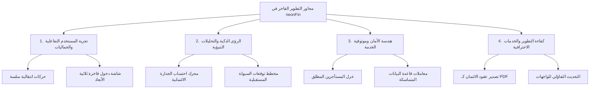

# 📊 تقرير التحليل الاستراتيجي واقتراحات التطوير المتقدمة — neonFin

> **إعداد:** Antigravity (ذكاء اصطناعي رائد في هندسة البرمجيات)
> **المشروع:** منصة التسهيلات الائتمانية والتمويل الأصغر الفاخرة [FinTech (neonFin)](file:///d:/ajeeb-app/FinTech-neonFin/README.md)
> **تاريخ التقييم:** 18 مايو 2026

---

## 🎯 الرؤية والهدف العام
بعد المراجعة العميقة لبنية مشروع **neonFin** وهيكل البيانات وقواعد العمل المحددة في [AI_RULES.md](file:///d:/ajeeb-app/FinTech-neonFin/AI_RULES.md), نلاحظ أن المنصة قد حققت قفزة هائلة في تفعيل لوحة تحكم المشرف الفائق (Super Admin), وتضمين شريط الأوامر السريع (Command Palette), ونظام الإشعارات المباشرة للمتأخرات.

الهدف الآن هو الانتقال بالمنصة من **"تطبيق وظيفي ممتاز"** إلى **"منتج مالي سيادي فاخر (WOW SaaS Experience)"** يدمج بين سلاسة التفاعل الحسي, ذكاء البيانات التنبؤية, وموثوقية المعاملات المالية الصارمة.

أدناه تقييم شامل للمنصة و**10 اقتراحات عملية ومفصلة** لرفع كفاءة الخدمة وتجربة المستخدم إلى المستوى الأقصى.

---

## 🗺️ خارطة تقييم النظام الحالي (Current Capabilities Map)

لقد قمنا بتحليل الملفات المفتوحة والنشطة في بيئة العمل, ووجدنا بنية تحتية برمجية متطورة للغاية:
* 🟢 **ذكاء النماذج:** يتجلى في [NewLoanModal.tsx](file:///d:/ajeeb-app/FinTech-neonFin/components/NewLoanModal.tsx) الذي يوفر تعبئة تلقائية لبيانات المقترضين ومعاينة حية وتفاعلية لجدول الأقساط.
* 🟢 **مركز الإجراءات المباشرة:** يظهر بوضوح في [client.tsx](file:///d:/ajeeb-app/FinTech-neonFin/app/dashboard/client.tsx) من خلال تنبيهات ذكية وأزرار دفع فورية وإرسال تذكيرات مباشرة للمقترضين عبر الـ WhatsApp بضغطة زر.
* 🟢 **البحث السريع والتنقل اللحظي:** يعتمد على [CommandPalette.tsx](file:///d:/ajeeb-app/FinTech-neonFin/components/CommandPalette.tsx) الفعال بـ `Ctrl+K` للتنقل السريع بين الوحدات لوحة التحكم, وإدارة القروض, وطلبات التحقق (KYC), وسجل المراقبة.
* 🟢 **أدوات التفاعل المحسنة:** بناء مكوّنات تأكيد وتنبيه مخصصة مثل [ConfirmDialog.tsx](file:///d:/ajeeb-app/FinTech-neonFin/components/ConfirmDialog.tsx) و[Toast.tsx](file:///d:/ajeeb-app/FinTech-neonFin/components/Toast.tsx) لإنهاء الاعتماد على الواجهات الافتراضية للجافا سكريبت بالكامل.
* 🟢 **التجاوب الذكي:** يحتوي [nav.tsx](file:///d:/ajeeb-app/FinTech-neonFin/app/dashboard/nav.tsx) على شريط تنقل علوي لسطح المكتب وقائمة جانبية منزلقة بالكامل للهواتف المحمولة مع حركات متدرجة وتوهج نشط.

---

## 🚀 المحاور الأربعة للتحسينات المقترحة (The 4 Pillars of Excellence)



---

### 1️⃣ المحور الأول: تجربة المستخدم التفاعلية والجماليات (Sensory & Visual UX)

> [!NOTE]
> يركز هذا المحور على الانطباع الأول للمستخدم والمشغلين, ومنحهم شعوراً بأن المنصة سريعة جداً, مصقولة بعناية, وتستجيب بذكاء لكل حركة.

#### 1.1: إضافة حركات انتقالية سلسة للصفحات (Elegant Page Transitions)
* **المشكلة الحالية:** تتنقل الصفحات في لوحة التحكم بشكل حاد ومفاجئ, مما يقلل من الفخامة البصرية للمنصة.
* **الاقتراح:** دمج تأثيرات تلاشي وحركة انزلاق علوي ناعمة (Fade-in-up) عند انتقال المسارات في [layout.tsx](file:///d:/ajeeb-app/FinTech-neonFin/app/dashboard/layout.tsx).
* **آلية التنفيذ البرمجية:**
  يمكن تطبيقها بسهولة عبر إضافة فئة حركة مخصصة في [globals.css](file:///d:/ajeeb-app/FinTech-neonFin/app/globals.css) مع استهداف المكون الرئيسي في [layout.tsx](file:///d:/ajeeb-app/FinTech-neonFin/app/dashboard/layout.tsx) كالتالي:
  ```css
  /* globals.css */
  .page-transition-wrapper {
    animation: slideUpFade 0.4s cubic-bezier(0.16, 1, 0.3, 1) forwards;
  }
  @keyframes slideUpFade {
    from {
      opacity: 0;
      transform: translateY(8px);
    }
    to {
      opacity: 1;
      transform: translateY(0);
    }
  }
  ```

#### 1.2: ترقية صفحة الدخول إلى واجهة سينمائية فاخرة (Cinematic Premium Login UX)
* **المشكلة الحالية:** على الرغم من جودة صفحة الدخول الحالية في [page.tsx](file:///d:/ajeeb-app/FinTech-neonFin/app/login/page.tsx), إلا أنها تعتمد على كرات خلفية ثابتة تنقصها الحركة التفاعلية.
* **الاقتراح:** تحويل الكرات الضوئية الخلفية المانحة للوهج إلى كتل هلامية متحركة ببطء (Moving Gradient Mesh blobs), مع تطبيق تأثير **نجاح بصري تفاعلي (Interactive Success Burst)** عند النقر على "دخول آمن" ونجاح التحقق قبل إعادة التوجيه للوحة القيادة.
* **طريقة التطوير البصرية:**
  تعديل كود الـ `div` الخاص بالخلفية المضيئة في [page.tsx](file:///d:/ajeeb-app/FinTech-neonFin/app/login/page.tsx) ليحتوي على تأثير الدوران والتحرك اللانهائي:
  ```css
  .animate-blob-slow {
    animation: blobMove 25s infinite alternate ease-in-out;
  }
  @keyframes blobMove {
    0% { transform: translate(0px, 0px) scale(1); }
    33% { transform: translate(30px, -50px) scale(1.1); }
    66% { transform: translate(-20px, 20px) scale(0.95); }
    100% { transform: translate(0px, 0px) scale(1); }
  }
  ```

---

### 2️⃣ المحور الثاني: الرؤى الذكية والتحليلات التنبؤية (Predictive Intelligence)

> [!TIP]
> في التكنولوجيا المالية, القيمة الحقيقية للبيانات تكمن في قدرتها على التنبؤ بالمستقبل وتنبيه أصحاب القرار بفرص التمويل أو مخاطر التعثر قبل وقوعها.

#### 2.1: مخطط توقعات التدفقات النقدية والسيولة (Predictive Cash Flow Chart)
* **المشكلة الحالية:** يعرض قسم التقارير [page.tsx](file:///d:/ajeeb-app/FinTech-neonFin/app/dashboard/reports/page.tsx) تحليلات ساكنة وتاريخية للمتدفقات المادية.
* **الاقتراح:** إدراج رسم بياني مستقبلي تنبئي (Cash Flow Projections) للـ 6 أشهر القادمة استناداً إلى جدول الأقساط النشطة المستحقة في جدول قاعدة البيانات `loanSchedules` المعرف في [schema.ts](file:///d:/ajeeb-app/FinTech-neonFin/schema/schema.ts).
* **الفائدة التشغيلية:** يتيح للمستثمرين معرفة حجم السيولة النقدية المتوقع دخولها للمحفظة شهرياً بدقة متناهية والتخطيط لإعادة استثمارها فوراً لتقليل السيولة الراكدة (Idle Capital).
* **آلية البيانات (Data Engine):**
  الاستعلام من جدول `loanSchedules` وتجمع المبالغ المستحقة `amount` حسب الشهر المستقبلي:
  ```typescript
  // API Route - Next.js
  const futureSchedules = await db.select({
    month: sql`to_char(${loanSchedules.dueDate}, 'YYYY-MM')`,
    expectedAmount: sql`sum(${loanSchedules.amount} - ${loanSchedules.paidAmount})`
  })
  .from(loanSchedules)
  .where(and(eq(loanSchedules.status, 'pending'), gte(loanSchedules.dueDate, new Date())))
  .groupBy(sql`to_char(${loanSchedules.dueDate}, 'YYYY-MM')`)
  .orderBy(sql`to_char(${loanSchedules.dueDate}, 'YYYY-MM')`);
  ```

#### 2.2: محرك الاحتساب التلقائي والترقية الفورية للجدارة الائتمانية (Dynamic Credit Scoring Engine)
* **المشكلة الحالية:** قيمة حقل التقييم الائتماني `score` في جدول القروض [schema.ts](file:///d:/ajeeb-app/FinTech-neonFin/schema/schema.ts) هي قيمة نصية ثابتة افتراضية (`A`) ولا تتبدل إلا بشكل يدوي.
* **الاقتراح:** ربط محرك برمجيات خلفي (Trigger/Service) يقوم بإعادة احتساب درجة التقييم الائتماني للمقترض بشكل ديناميكي بناءً على نسبة التزامه في السداد المسجلة في ملفه الشخصي الفاخر [page.tsx](file:///d:/ajeeb-app/FinTech-neonFin/app/dashboard/borrowers/%5Bname%5D/page.tsx).
* **معايير التقييم المقترحة:**
  * 🥇 **التقييم `A+`:** نسبة الالتزام بالسداد في الوقت المحدد `complianceRate` = 100%.
  * 🥈 **التقييم `A`:** نسبة الالتزام بالسداد بين 90% و99%.
  * 🥉 **التقييم `B`:** وجود دفعة متأخرة واحدة أو نسبة التزام بين 75% و89%.
  * ⚠️ **التقييم `C-`:** وجود أقساط متأخرة لأكثر من 30 يوماً (دخول مرحلة الخطر).
* **التأثير البصري:** يظهر في صفحة المقترض مؤشر سهمي ملون ديناميكي يوضح هل تصنيف المقترض في صعود (تحسن) أم في هبوط (مخاطر عالية), مما يسهل اتخاذ قرار منح تسهيل ائتماني جديد.

---

### 3️⃣ المحور الثالث: هندسة الأمان وموثوقية الخدمة (Security & Reliability)

> [!IMPORTANT]
> حماية أموال المستثمرين وخصوصية المستأجرين هي صمام الأمان لمنصات التكنولوجيا المالية. تطبيق معايير الأمان المذكورة في [AI_RULES.md](file:///d:/ajeeb-app/FinTech-neonFin/AI_RULES.md) يمنع الاختراقات وتسريب البيانات.

#### 3.1: عزل المستأجرين المطلق وقفل الـ IDOR (Tenant Isolation Sandbox)
* **المشكلة الحالية:** قد ينسى المطور أحياناً تصفية الاستعلامات بواسطة `tenantId` عند جلب قائمة القروض أو المقترضين, وهو ما يقع في ثغرات الـ IDOR الخطيرة.
* **الاقتراح:** بناء طبقة وسيطة (Drizzle Query Middleware) أو دالة مساعدة معيارية يتم تمريرها في كل استعلام لقاعدة البيانات لضمان قفل البيانات لكل مستأجر.
* **نموذج مطبق لقواعد [AI_RULES.md](file:///d:/ajeeb-app/FinTech-neonFin/AI_RULES.md#L129-L141):**
  بدلاً من كتابة الاستعلامات الحرة, نعتمد دائماً التصفية الصارمة للمستأجر من الجلسة الآمنة المُتحقق منها:
  ```typescript
  // lib/db-helper.ts
  export async function getTenantLoans(db: any, tenantId: string) {
    return await db.select()
      .from(loans)
      .where(eq(loans.tenantId, tenantId));
  }
  ```

#### 3.2: تفعيل نظام المعاملات الصامت لقاعدة البيانات (Atomic Database Transactions)
* **المشكلة الحالية:** عند قيام المشغل بإنشاء قرض جديد بقيمة ائتمانية معينة, يتم إدراج صف القرض في جدول `loans` ثم إدراج الأقساط المجدولة في جدول `loanSchedules` بشكل منفصل. في حال حدوث عطل في المخدم أثناء العملية, قد يُخلق القرض بدون أقساط, مما يشوه الميزانية المالية والتقارير.
* **الاقتراح:** تجميع عمليتي الإدراج داخل معاملة واحدة متماسكة ومحمية `db.transaction`.
* **طريقة التطبيق:**
  ```typescript
  // app/api/loans/route.ts
  await db.transaction(async (tx) => {
    // 1. إدراج القرض الجديد
    const [newLoan] = await tx.insert(loans).values(loanData).returning();
    
    // 2. إدراج الأقساط المرتبطة به تلقائياً دفعة واحدة
    await tx.insert(loanSchedules).values(
      schedules.map(s => ({ ...s, loanId: newLoan.id }))
    );
  });
  ```

#### 3.3: التحديث التفاؤلي الفوري لسداد الأقساط (Optimistic Repayment UI)
* **المشكلة الحالية:** عند تسجيل سداد قسط في واجهة تفاصيل القرض [page.tsx](file:///d:/ajeeb-app/FinTech-neonFin/app/dashboard/loans/%5Bid%5D/page.tsx), ينتظر النظام رد الخادم بالكامل لتحديث الصفحة وتعديل حالة القسط إلى "مسدد", مما يُشعر المشغل بثقل الاستجابة.
* **الاقتراح:** استخدام ميزة التحديث التفاؤلي (Optimistic Updates via React `useOptimistic`)؛ بحيث تتحول حالة القسط فوراً إلى اللون الأخضر الزاهي وتتعدل العدادات المالية في جزء من الثانية (0ms delay), وفي حال فشل الاتصال مع المخدم يتم استعادة الحالة السابقة تلقائياً مع إشعار خطأ أحمر عبر نظام الـ Toast الفاخر.

---

### 4️⃣ المحور الرابع: كفاءة التطوير والخدمات الاحترافية (Velocity & Premium Services)

> [!WARNING]
> تقديم خدمة جيدة يعني أيضاً تمكين المشغلين من طباعة وتصدير مستندات رسمية موثوقة تسلم للمقترضين والمستثمرين لتوثيق المعاملات قانونياً.

#### 4.1: نظام تصدير عقود الائتمان وكشوفات الحساب الفاخرة (Branded PDF Generator)
* **المشكلة الحالية:** لا تملك المنصة وسيلة رسمية لتصدير البيانات, ويعتمد المشغلون على تصوير الشاشة أو خيار الطباعة التقليدي للمتصفح المفتقد للتنسيق.
* **الاقتراح:** دمج محرك توليد مستندات PDF احترافي (باستخدام مكتبة `@react-pdf/renderer` أو بناء واجهة طباعة CSS نظيفة ومعيارية `@media print` مصممة خصيصاً بشعار **neonFin** وهوية المؤسسة المستأجرة).
* **مواصفات التصدير المالي:**
  * 📄 **سند سداد قسط:** مستند مصغر يثبت استلام الدفعة, تاريخ الاستلام, واسم المستلم.
  * 📄 **عقد التسهيل الائتماني:** ورقة رسمية مطبوعة تحتوي على تفاصيل القرض الإجمالية, الفائدة, وجدول الأقساط التفصيلي مع مساحة للتوقيعات.
  * 📄 **كشف حساب المقترض:** يُصَدَّر مباشرة من واجهة المقترض الشاملة [page.tsx](file:///d:/ajeeb-app/FinTech-neonFin/app/dashboard/borrowers/%5Bname%5D/page.tsx) ويظهر تاريخ كل العمليات المالية التي أجراها.

#### 4.2: التعبئة الذكية المتقدمة ومسح المستندات ضوئياً (OCR Loan Creation Assistant)
* **المشكلة الحالية:** يتطلب إدخال بيانات مقترض جديد كتابة الاسم, رقم الهاتف, العنوان, والوظيفة يدوياً, وهو أمر يستغرق وقتاً طويلاً وقابل للخطأ البشري.
* **الاقتراح:** توسيع ذكاء [NewLoanModal.tsx](file:///d:/ajeeb-app/FinTech-neonFin/components/NewLoanModal.tsx) ليتضمن ميزة سحب وإفلات صورة البطاقة الوطنية للمقترض, ومن ثم معالجتها عبر الذكاء الاصطناعي (OCR خفيف عبر API) لتعبئة كافة حقول النموذج فورياً بدقة متناهية وبلا أي جهد يدوي.

---

## 📈 جدول مقارنة الأثر والجهد التقني (Impact & Feasibility Matrix)

لمساعدتك في اختيار ما تبدأ به فوراً, قمنا بتقييم كافة الاقتراحات السابقة وفقاً لـ **العائد الاستثماري للتجربة (UX ROI)** وصعوبة التنفيذ البرمجي:

| الاقتراح | الأثر على التجربة | الصعوبة التقنية | الأولوية المقترحة | الملفات المعنية |
| :--- | :---: | :---: | :---: | :--- |
| **3.2 المعاملات المتماسكة (Database Transactions)** | 🔥 مرتفع جداً | 🟢 منخفضة | 🚨 **أولوية 1 (سلامة البيانات)** | [route.ts](file:///d:/ajeeb-app/FinTech-neonFin/app/api/loans/route.ts) |
| **3.1 عزل المستأجرين المطلق (IDOR Prevention)** | 🔥 مرتفع جداً | 🟢 منخفضة | 🚨 **أولوية 1 (أمان سيادي)** | [db.ts](file:///d:/ajeeb-app/FinTech-neonFin/lib/db.ts) |
| **4.1 واجهة تصدير وطباعة PDF وعقود التمويل** | 🌟 مميز جداً | 🟡 متوسطة | 📅 **أولوية 2 (احترافية الخدمة)** | [page.tsx](file:///d:/ajeeb-app/FinTech-neonFin/app/dashboard/loans/%5Bid%5D/page.tsx) |
| **2.2 محرك التقييم الائتماني الديناميكي الآلي** | ⚡ تفاعلي ذكي | 🟡 متوسطة | 📅 **أولوية 2 (ذكاء مالي)** | [schema.ts](file:///d:/ajeeb-app/FinTech-neonFin/schema/schema.ts) |
| **2.1 مخطط توقعات السيولة والتدفق النقدي** | ⚡ تفاعلي ذكي | 🟡 متوسطة | 📅 **أولوية 2 (تقارير مستثمرين)** | [reports/page.tsx](file:///d:/ajeeb-app/FinTech-neonFin/app/dashboard/reports/page.tsx) |
| **1.1 حركات انتقالية سلسة للمسارات** | 🎨 جمالي فخم | 🟢 منخفضة | 💅 **أولوية 3 (جمال بصري)** | [layout.tsx](file:///d:/ajeeb-app/FinTech-neonFin/app/dashboard/layout.tsx) |
| **1.2 ترقية صفحة الدخول لحركات تدرج متحرك** | 🎨 جمالي فخم | 🟢 منخفضة | 💅 **أولوية 3 (الانطباع الأول)** | [login/page.tsx](file:///d:/ajeeb-app/FinTech-neonFin/app/login/page.tsx) |
| **3.3 التحديث التفاؤلي لسداد الدفعات (0ms)** | ⚡ تفاعلي ذكي | 🔴 عالية | ⚙️ **أولوية 4 (سرعة فائقة)** | [loans/[id]/page.tsx](file:///d:/ajeeb-app/FinTech-neonFin/app/dashboard/loans/%5Bid%5D/page.tsx) |
| **4.2 مساعد القروض الذكي بالمسح الضوئي OCR** | 🌟 مميز جداً | 🔴 عالية | ⚙️ **أولوية 4 (تكامل AI)** | [NewLoanModal.tsx](file:///d:/ajeeb-app/FinTech-neonFin/components/NewLoanModal.tsx) |

---

## 🏁 التوصية الختامية وخطوات العمل القادمة
يسعدني جداً قيامك بالارتقاء بمنصة **neonFin** إلى هذا المستوى الاحترافي الفاخر والمستقر.
توصيتي التقنية المباشرة هي البدء بـ **المحور الثالث (الأمان والموثوقية)** لحماية البيانات وعمليات قاعدة البيانات من أي تداخل, ومن ثم الانتقال لـ **توليد وتصدير كشوفات وعقود الائتمان كملفات PDF منسقة** لخدمة المقترضين والمشغلين بشكل فوري.

> [!TIP]
> **هل ترغب في البدء بتنفيذ أي من هذه التحسينات فوراً؟**
> فقط حدد لي الرقم (مثلاً: "تطبيق المعاملات المتماسكة 3.2" أو "تصميم واجهة طباعة العقود PDF 4.1")، وسأقوم ببناء وتكامل الأكواد بدقة متناهية تحت مظلة [AI_RULES.md](file:///d:/ajeeb-app/FinTech-neonFin/AI_RULES.md).
